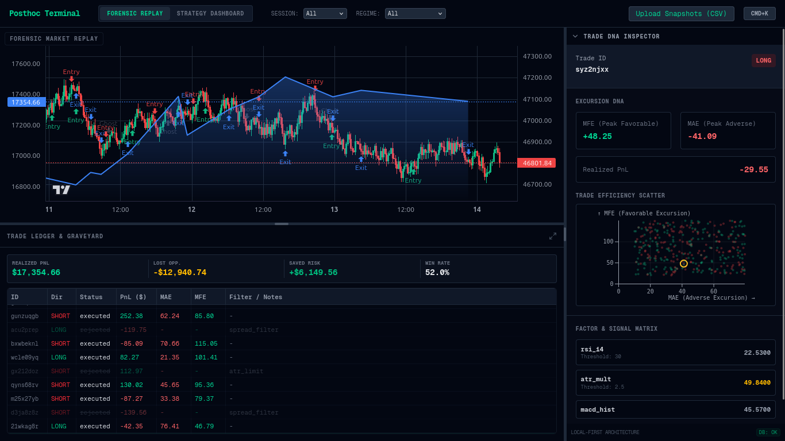

# Posthoc Terminal: Forensic Research Environment

**Posthoc Terminal** is an institutional-grade, high-performance decision-analysis environment built for forensic trade reconstruction and probabilistic strategy audit. It moves beyond standard retail metrics, treating the browser as a heavy-duty visualization engine for complex quant data.

**[Live Demo: posthoc-terminal.vercel.app](https://posthoc-terminal.vercel.app/)**



## 🏛 The Philosophy
Most trading tools focus on "The Result." **Posthoc** focuses on "The Process." By exhuming rejected trades and visualizing "Ghost" signals, the terminal allows researchers to identify logic leakage, over-optimization, and regime-specific failure points.

*   **Local-First:** Your data never leaves your browser.
*   **Forensic Fidelity:** Teleport to any trade in `<16ms`.
*   **Quant-Grade:** Monte Carlo simulations and parameter sensitivity as standard.

---

## 🛠 Core Analytical Environments

Posthoc Terminal provides two distinct, synchronized lenses on your quantitative research:

### 1. The Forensic Replay (Micro View)
The "Cockpit" for micro-audits and trade-by-trade reconstruction.
*   **The Teleport Engine:** Instant viewport snapping to any trade ID with smart-zoom for context.
*   **The Trade Graveyard:** Visualize "Ghost Trades" (rejected alpha signals) to analyze opportunity costs and filter attribution.
*   **Trade DNA Inspector:** Real-time query of the exact indicator/factor values (RSI, ATR, etc.) at the micro-moment of entry.
*   **MAE/MFE Scatter:** Analysis of trade efficiency—identifying how much "heat" a trade took before reaching profit.

### 2. The Strategy Dashboard (Macro View)
The macro-analysis environment built with **100% TradingView Strategy Tester parity** and enhanced robustness metrics.
*   **Cumulative Equity & Drawdown:** Synchronized high-fidelity curves with integrated "Underwater" histograms.
*   **Directional Performance:** One-click segmentation of all metrics by **Long** vs. **Short** performance.
*   **Benchmark Comparison:** Strategy Outperformance vs. Buy & Hold Return.
*   **Robustness Lab:** Integrated Monte Carlo engine (10k runs) to calculate 95th percentile Max Drawdown and Probability of Ruin.

---

## ⌨️ Power User Navigation
Designed for high-velocity research. No "Retail" whitespace.
*   `Cmd + K`: Open Command Palette (Jump to Trade ID, Switch Environment).
*   `Space`: Toggle between **Forensic Replay** and **Strategy Dashboard**.
*   `← / →`: Step through the trade ledger sequence chronologically.
*   `T`: Instant **Teleport** to the currently selected trade.
*   `G`: Toggle **Graveyard Layer** (Show/Hide ghost signals on chart).

---

## 🏗 High-Performance Architecture

Posthoc is built on a **Columnar Data Stack** to ensure 60fps interaction even with millions of data points.

*   **Next.js 15 (App Router):** Modern React foundation.
*   **DuckDB-Wasm:** Fast analytical SQL queries performed directly on your local CSV/Parquet files.
*   **Zustand:** Low-overhead state management for "Committed" research state.
*   **Mitt (Event Bus):** High-frequency pub/sub for crosshair syncing and chart telemetry (bypassing React re-renders).
*   **Web Workers:** Off-main-thread computation for heavy bootstrapping and Monte Carlo simulations.

---

## 📊 Data Contracts
The terminal expects four relational files (CSV or Parquet). See [Data Schema Docs](docs/DATA_CONTRACTS.md) for full specs.

1.  **`candles.csv`**: Unix Timestamp, OHLCV, and optional Regime/Session tags.
2.  **`trades.csv`**: Master ledger containing `entry_time`, `exit_time`, `pnl`, `mae`, `mfe`, and `status` (executed/rejected).
3.  **`signals.csv`**: Factor/Indicator values at entry time, linked by `trade_id`.
4.  **`sweeps.csv`**: Data for parameter sensitivity heatmaps (Sharpe/Sortino vs. Variables).

---

## 🚀 Getting Started

### Installation
```bash
git clone https://github.com/posthoc-research/terminal.git
cd terminal
npm install
```

### Development
```bash
npm run dev
```

### Generating Mock Data
To explore the terminal's forensic features without your own dataset, generate a synthetic institutional snapshot:
```bash
node scripts/generate-mock.js
```
Drag the resulting files from `/data/mock/` into the terminal uploader.

---

## 🗺 Roadmap
- [x] **Core Engine:** DuckDB-Wasm integration and Forensic Replay.
- [ ] **Graveyard:** Filter attribution and opportunity cost visualization.
- [ ] **Multi-Run Compare:** Side-by-side comparison of two strategy snapshots.
- [ ] **Notebook Integration:** Export specific trade forensic snapshots to Markdown/PDF reports.
- [ ] **Broker Connectors:** Read-only sync for real-time forensic auditing of live accounts.

---
## 🤝 Contributing

Posthoc Terminal is built on a "Performance-First" mandate. We welcome contributions from the quant and engineering community, provided they adhere to our architectural rigors.

### Core Engineering Mandates for Contributors:
*   **No `any` Policy:** Strict TypeScript is non-negotiable. All data structures must be typed.
*   **The 16ms Rule:** Any UI contribution must be profiled. If a component causes a frame-drop during crosshair sync or teleportation, it will not be merged.
*   **Columnar Logic:** Avoid iterative "Array of Objects" patterns. Leverage DuckDB-Wasm and Typed Arrays for data processing.
*   **Separation of Concerns:** Keep analytical logic in `/src/engine` and UI logic in `/src/components`.

### How to Help:
1.  **Forensic Modules:** Build new "Trade DNA" visualizations or filter attribution logic.
2.  **Robustness Metrics:** Add new statistical tests (e.g., K-S Test, Bias Ratio) to the Strategy Dashboard.
3.  **Data Adapters:** Help expand our support for Parquet and Arrow schemas.

Check out our [Contribution Guidelines](CONTRIBUTING.md) for setup instructions and code standards.

---

## 🔒 Privacy & Sovereignty
**Your Alpha is yours alone.**
Posthoc Terminal is 100% client-side. There is no backend, no tracking, and no data collection. When you "Upload" a snapshot, the data is loaded into an in-memory instance of DuckDB on your machine. This makes it suitable for high-compliance environments and proprietary research.

---

## ⚖️ License
Licensed under the [MIT License](LICENSE).

---

**Built for those who obsess over the "Cause of Death" of a trade.**
*Maintained by Posthoc Research.*